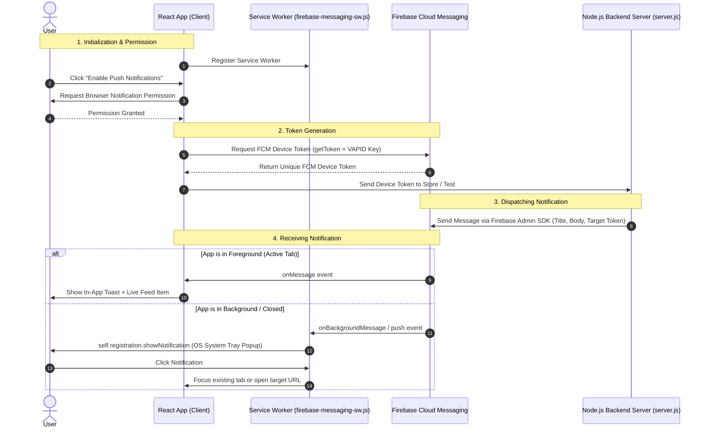

# 🔔 Web Push Notification System (Full Stack React + Node.js + Firebase FCM)

A full-stack Web Push Notification system built with **React 19**, **TypeScript**, **Express.js**, and **Firebase Cloud Messaging (FCM v12)** supporting **Black & White Themes**, Foreground In-App Toasts, and Background Service Worker notifications.

---

## 🧭 Push Notification Flow



---

## 🔄 Step-by-Step Flow Explanation

### 1. Service Worker Registration
* When the web application loads, `registerServiceWorker()` registers `/firebase-messaging-sw.js` in the browser scope.
* The Service Worker is initialized with Firebase credentials to listen for background events even when the webpage is minimized or closed.

### 2. Requesting User Permission
* The application prompts the user via `Notification.requestPermission()`.
* If granted, the app proceeds to token retrieval.

### 3. FCM Device Token Retrieval
* The client calls `getToken(messaging, { vapidKey, serviceWorkerRegistration })`.
* Firebase returns a unique registration token specifically identifying this device/browser instance.
* In a production app, you save this token to your backend database against the user's account.

### 4. Sending a Push Message from Backend
* Your Express backend (`POST /api/send-notification`) triggers a notification targeting the saved FCM token using the **Firebase Admin SDK**.

### 5. Handling Incoming Messages
* **Foreground (Tab Open & Focused)**: `onMessage(messaging, callback)` triggers inside [NotificationListener.tsx](file:///d:/vikram820/push-notification/src/utility/NotificationListener.tsx), displaying an animated floating toast and updating the Received Notifications feed.
* **Background / Tab Closed**: `messaging.onBackgroundMessage` in [firebase-messaging-sw.js](file:///d:/vikram820/push-notification/public/firebase-messaging-sw.js) receives the push payload and displays a native system notification tray popup via `self.registration.showNotification()`.
* **Notification Click**: Clicking the notification focuses the open tab or navigates to the specified URL.

---

## 📁 Project Structure

```
push-notification/
├── public/
│   ├── firebase-messaging-sw.js   # Background service worker
│   └── favicon.svg                # Notification icon
├── server/
│   ├── server.js                  # Express API server for dispatching notifications
│   ├── send-test.js               # CLI test tool for terminal sending
│   ├── serviceAccountKey.sample.json # Template for Firebase Admin credentials
│   └── serviceAccountKey.json     # (Place your downloaded Firebase key here)
├── src/
│   ├── components/
│   │   └── NotificationToast.tsx  # In-app foreground toast banner
│   ├── utility/
│   │   ├── notification.ts        # SW registration & FCM token helper
│   │   └── NotificationListener.tsx # Foreground message listener
│   ├── firebase.ts                # Client-side Firebase SDK init
│   ├── App.tsx                    # Received notifications box & Black/White UI
│   ├── App.css                    # Clean Black & White themes styling
│   └── main.tsx                   # React entrypoint
├── .env                           # Client & server environment variables
└── package.json
```

---

## ⚙️ Environment Configuration (`.env`)

Create a `.env` file in the root directory:

```env
# Client Keys (from Firebase Console -> Project Settings -> General)
VITE_FIREBASE_API_KEY=your_api_key
VITE_FIREBASE_AUTH_DOMAIN=your_project.firebaseapp.com
VITE_FIREBASE_PROJECT_ID=your_project_id
VITE_FIREBASE_STORAGE_BUCKET=your_project.firebasestorage.app
VITE_FIREBASE_MESSAGING_SENDER_ID=your_sender_id
VITE_FIREBASE_APP_ID=your_app_id
VITE_FIREBASE_VAPID_KEY=your_web_push_vapid_public_key

# Backend Port (Optional, defaults to 5000)
PORT=5000
```

---

## 🔑 Backend Setup (Firebase Admin Credentials)

To allow the Node.js backend to dispatch notifications securely:

1. Open **[Firebase Console](https://console.firebase.google.com/)**.
2. Go to **Project Settings** (⚙️) -> **Service Accounts**.
3. Click **Generate new private key** and download the `.json` file.
4. Rename the downloaded file to `serviceAccountKey.json` and place it inside the `server/` folder:
   ```
   server/serviceAccountKey.json
   ```

---

## 🚀 Running the Application

### 1. Start Frontend (React App)
```bash
npm run dev
```
*Frontend runs on `http://localhost:5173`*

### 2. Start Backend Server (Express API)
In a separate terminal:
```bash
npm run server
```
*Backend runs on `http://localhost:5000`*

---

## 📡 Backend API Endpoints

### 1. Send to Single Device Token
* **POST** `http://localhost:5000/api/send-notification`
* **Headers**: `Content-Type: application/json`
* **Body**:
```json
{
  "token": "<YOUR_FCM_DEVICE_TOKEN>",
  "title": "Order Shipped! 📦",
  "body": "Your package is on the way.",
  "data": {
    "orderId": "12345",
    "url": "http://localhost:5173"
  }
}
```

### 2. Send to Multiple Device Tokens (Multicast)
* **POST** `http://localhost:5000/api/send-multicast`
* **Body**:
```json
{
  "tokens": ["<TOKEN_1>", "<TOKEN_2>"],
  "title": "Flash Sale! ⚡",
  "body": "50% off on all items today only."
}
```

### 3. Send to Topic
* **POST** `http://localhost:5000/api/send-topic`
* **Body**:
```json
{
  "topic": "all-users",
  "title": "System Update",
  "body": "A new version of the app is available."
}
```

---

## 🧪 Testing Push Notifications

### Method 1: Via the Frontend UI
1. Open `http://localhost:5173`.
2. Click **"Enable Push Notifications"** and copy the generated device token.
3. Click **"Send Test Notification"** (automatically dispatches via `http://localhost:5000/api/send-notification`).

### Method 2: Via CLI Script (Terminal)
Run the built-in send script:
```bash
npm run send -- <YOUR_FCM_DEVICE_TOKEN> "Special Offer 🎁" "Check out your dashboard"
```

### Method 3: Via cURL
```bash
curl -X POST http://localhost:5000/api/send-notification \
  -H "Content-Type: application/json" \
  -d '{
    "token": "<YOUR_FCM_DEVICE_TOKEN>",
    "title": "Server Alert",
    "body": "Testing FCM delivery from cURL"
  }'
```
